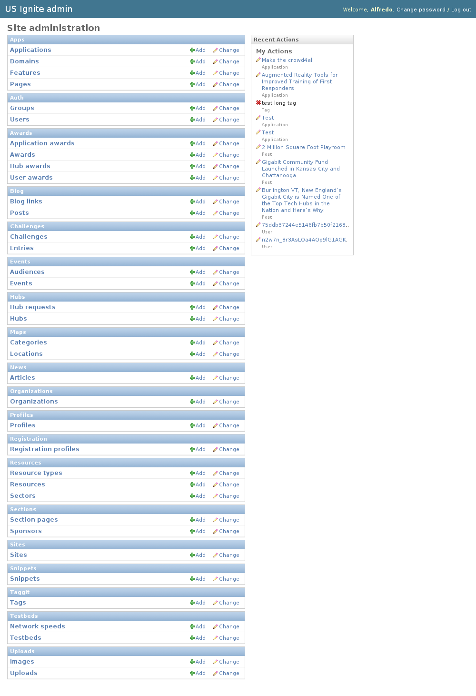

Admin Section
=============

An administration section is provided for the site.

Admin access can only be granted by another administrator.

The admin section is available in the ``/admin/`` URL.

The admin section provides access to all the management sections of the site.

The admin is organized by sections:

- Apps: This section list the ``applications`` and appliations mechanics of the site.
- Auth: This section list the ``users`` registered in the site.
- Awards: This section list the ``awards`` and awards mechanics of the site.
- Blog: This section list the imported ``blog`` posts of the site and the ``links`` that appear in it.
- Challenges: This section list the ``challenges`` and ``entries``.
- Events: This section list the ``events`` of the site.
- Hubs: This section list the ``communities`` and community requests of the site.
- Maps: This shows the locations and categories that can be added to the map of the site.
- News: This section allows to manage the articles that appear in the news section in the sidebar.
- Organizations: This section allows to manage the ``organizations`` of the site.
- Profiles: This section list the profiles of the registered users.
- Resources: This section allows to manage the ``resources`` of the site.
- Sections: This area allows to add ``sections`` and ``sponsors`` to the site.
- Snippets: This section manages the ``snippets`` of content on key sections of the site.
- Taggit: Manages the ``tags`` of the different elements of the site.
- TestBeds: Manages the ``testbeds`` in the site.
- Uploads: Allows to upload imagery or files to the site.

