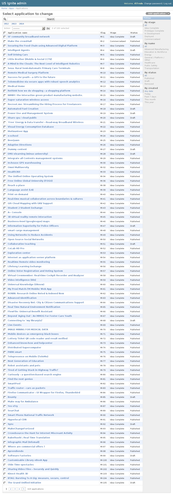
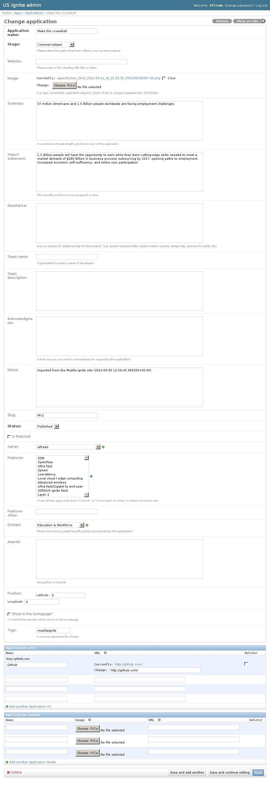
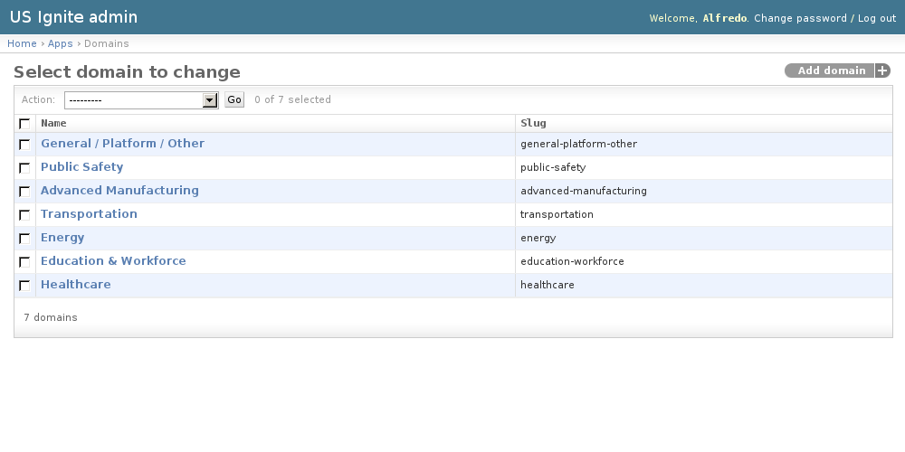
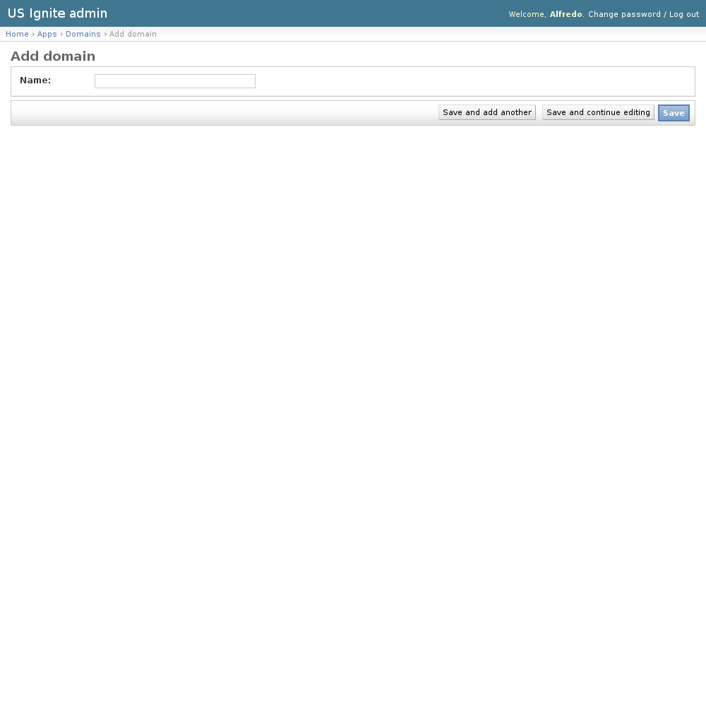
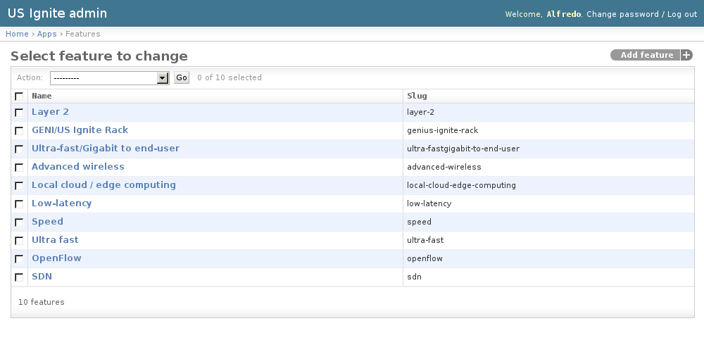
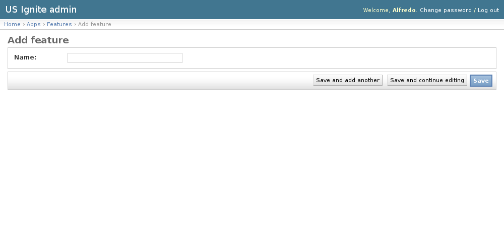
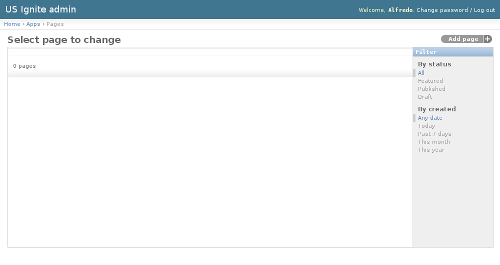
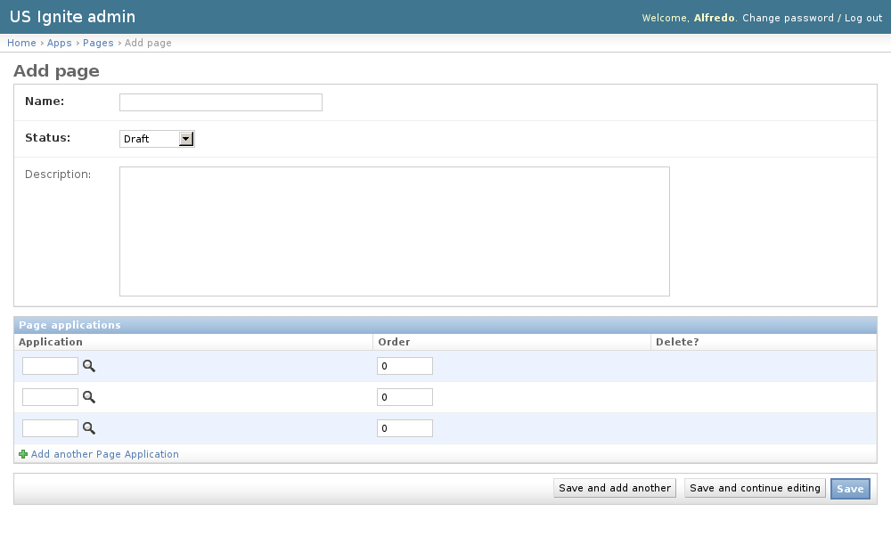

Apps admin section
==================

This section list the ``apps`` section and its usage in the site.

View existing Applications
--------------------------

The existing Applications can be listed in the ``/admin/apps/application/`` URL. From this section the details of these Applications can be inspected.

And the following actions can be performed:

- View the details of the Applications.
- Filter the Applications by: Stage, Domain, Status or Creation date.
- Search the Applications by their contents.

Adding Applications
-------------------

Adding applications **must** be strictly done from the front end of the site.

Viewing applications details
----------------------------

Accessing Applications detail pages can be done from the ``/admin/apps/application/`` URL.

The following fields are part of the Applications detail:

- Application name: Required. Name of the application
- Stage: Required. Option that best reflects the applciation current progress.
- Website: Optional. Fully qualified URL of the website.
- Image: Optional. Logo, screenshot, application diagram, photo of demo. Image suggested size: 500x400px.
- Summary: Optional. One sentence (tweet-length) pitch/summary of the application.
- Impact statement: Optional. Who benefits and how in one paragraph or less.
- Assistance: Optional. Does the Project require any help? (e.g. specific technical skills, subject matter experts, design help, partners for pilots, etc)
- Team name: Optional. Organization/Company name of developers.
- Team description: Optional. Short description of the team.
- Acknowledgments: Optional. Acknowledgements from the application team.
- Notes: Optional. Admin notes regarding this application, not public.
- Slug: Optional. Slug used for this application.
- Status: Required. Status of the publication of the application.
- Is featured: Optional. Show this app should be shown as part of the featured list.
- Owner: Optional. Owner of this application.
- Features: Optional. Features that this application takes advantage of.
- Features other: Optional. Other features not listed in the previous option.
- Domain: Optional. Primary public benefit served by this application.
- Awards: Optional. Recognition or Awards.
- Position: Optional. Position in a map of this application.
- Show in the homepage?: Optional. If marked this element will be shown in the homepage. Only a single element will be shown, once saved will replace any previous element in the homepage.
- Tags: Optional. A comma-separated list of tags.
- Application URLs. Extra URLs where progress of this application can be followed.
- Application media. Extra imagery/videos that are part of this application.

Unpublishing / Removing  Applications
-------------------------------------

In case Applications needs unpublishing it can be done from the detail admin view by changing the ``status`` of the Applications to ``draft`` or ``removed``

.. note::
   The Applications can be browsed in the ``/admin/apps/application/`` URL.

View existing Domains
---------------------

Domains are the categories which describe the main purpose of an application. These are used to filter and organize the applications in the front end. The names of the domains are used to determine the current imagery used to describe them.

The existing Domains can be listed in the ``/admin/apps/domain/`` URL. From this section the details of these Domains can be inspected.

And the following actions can be performed:

- View the details of the Domains.

Adding Domains
--------------

Adding Domains can be done from the ``/admin/apps/domain/add/`` URL.

The following fields are available to create Domains:

- Name: Required. Name of the application.

These Domains are created so ...

.. notes::
   Adding new domains require front end amends to add the icon that describe the category, otherwise a fallback icon will be used.

View existing Features
----------------------

The features describe the next-gen elements that Applications take advantage of.

The existing Features can be listed in the ``/admin/apps/feature/`` URL. From this section the details of these Features can be inspected.

And the following actions can be performed:

- View the details of the Features.

Adding Features
---------------

Adding Features can be done from the ``/admin/apps/feature/add/`` URL.

The following fields are available to create Features:

- Name: Required. Name of the feature.

.. notes::
   An slug will be generated for the feature automatically based on the name.

View existing Pages
-------------------

The pages are used to showcase a determined list of applications.

The existing Pages can be listed in the ``/admin/apps/page/`` URL. From this section the details of these Pages can be inspected.

And the following actions can be performed:

- View the details of the Pages.
- Filter the Pages by: Status or Creation date..

Adding Pages
------------

Adding Pages can be done from the ``/admin/apps/page/add/`` URL.

The following fields are available to create Pages:

- Name: Required. Name of the list to be generated.
- Status: Required. Status of the list of applications.
- Description: Optional. Description of the application list.
- Page Applications: List of applications that will be shown in the order specified.

These Pages are created so ...

Unpublishing / Removing  Pages
------------------------------

In case Pages needs unpublishing it can be done from the detail admin view by changing the ``status`` of the Pages to ``draft`` or ``removed``

.. note::
   The Pages can be browsed in the ``/admin/apps/page/`` URL.
