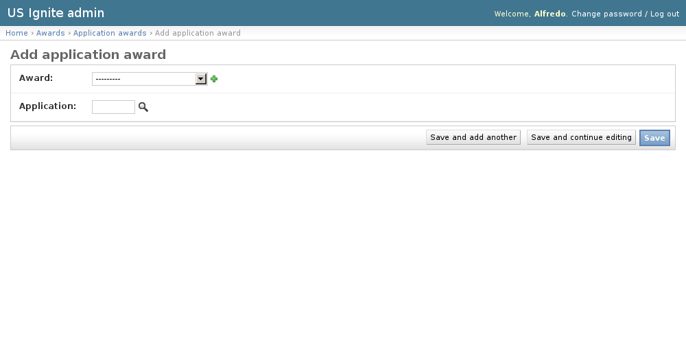

Admin awards
============

This section list the ``awards`` and awards mechanics of the site.

The process to give an award is:

- Create an award (with or without imagery).
- Give the award to an application, community, or user.

View existing awards
--------------------

The existing awards can be seen in the ``/admin/awards/award/`` section. From this section the details of these awards can be inspected.

.. image:: ../snapshots/admin--awards--award.png
           :width: 100%

Add an award
------------

The awards can be added in the ``/admin/awards/award/add/`` section. The following vields can be created:

- Name. Required. Name of the award.
- Image. Optional. Imagery used to display the award.
- Description. Optional. Used to describe the award.

These awards are created so they can be assigned to an application, community, or user at a later point.

.. image:: ../snapshots/admin--awards--award--add.png
           :width: 100%

Give an award to an application
-------------------------------

The awards can be given to an application in the ``/admin/awards/applicationaward/add/`` section.

Here an award and an application can be selected. The magnifying glass icon will pop up a window to select the awarded application.

To select the award clicking on the name of the application will close the pop-up window and add the id of the application to the form.

.. note::
   The searching form to filter the applications by content will be available from the pop up window.

The award will be published as soon as the ``save`` button is pressed.

Give an award to a community
----------------------------

Give an award to a user
-----------------------

