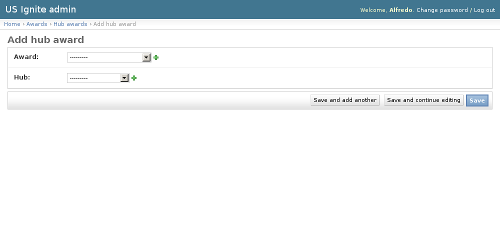

Admin awards
============

This section list the ``awards`` section and its usage in the site.

The process to give an award is:

- Create an award (with or without imagery).
- Give the award to an application, community, or user.

Adding Awards
-------------

The awards can be added in the ``/admin/awards/award/add/`` section. The following vields can be created:

- Name: Required. Name of the award.
- Image: Optional. Imagery used to display the award.
- Description: Optional. Used to describe the award.

These awards are created so they can be assigned to an application, community, or user at a later point.

View existing Awards
--------------------

The existing Hub Awards can be listed in the ``/admin/awards/hubaward/`` URL. From this section the details of these Hub Awards can be inspected.

And the following actions can be performed:

- View the details of the Awards.

.. image:: ../snapshots/admin--awards--award.png
           :width: 100%

Give an award to an Application
-------------------------------

The awards can be given to an application in the ``/admin/awards/applicationaward/add/`` section.

Here an award and an application can be selected. The magnifying glass icon will pop up a window to select the awarded application.

To select the award clicking on the name of the application will close the pop-up window and add the id of the application to the form.

.. note::
   The searching form to filter the applications by content will be available from the pop up window.

The award will be published as soon as the ``save`` button is pressed.

.. image:: ../snapshots/admin--awards--applicationaward--add.png
   :width: 100%

View existing Application Awards
--------------------------------

The existing Application Awards can be listed in the ``/admin/awards/applicationaward/`` URL. From this section the details of the Application Awards can be inspected.

And the following actions can be performed:

- View the details of the Application Awards.
- Filter the Application Awards by: Award Name.

Give an Award to a Community
----------------------------

The awards can be given to Communities in the ``/admin/awards/hubaward/add/`` section.

Here an Award and an Community can be selected. The award will be published as soon as the ``save`` button is pressed.

.. note::
   The searching form to filter the Communities by content will be available from the pop up window.

View existing Community Awards
------------------------------

The existing Community Awards can be listed in the ``/admin/awards/hubaward/`` URL. From this section the details of the Community Awards can be inspected.

And the following actions can be performed:

- View the details of the Hub Awards.
- Filter the Hub Awards by: Award Name.

.. image:: ../snapshots/admin--awards--hubaward.png
   :width: 100%

Give an Award to a User
-----------------------

The Awards can be given to Users in the ``/admin/awards/useraward/add/`` URL.

Here an Award and a User can be selected. The award will be published as soon as the ``save`` button is pressed.

.. image:: ../snapshots/admin--awards--useraward--add.png
   :width: 100%

View existing User Awards
-------------------------

The existing User Awards can be listed in the ``/admin/awards/useraward/`` URL. From this section the details of the User Awards can be inspected.

And the following actions can be performed:

- View the details of the User Awards.
- Filter the User Awards by: Award name.

