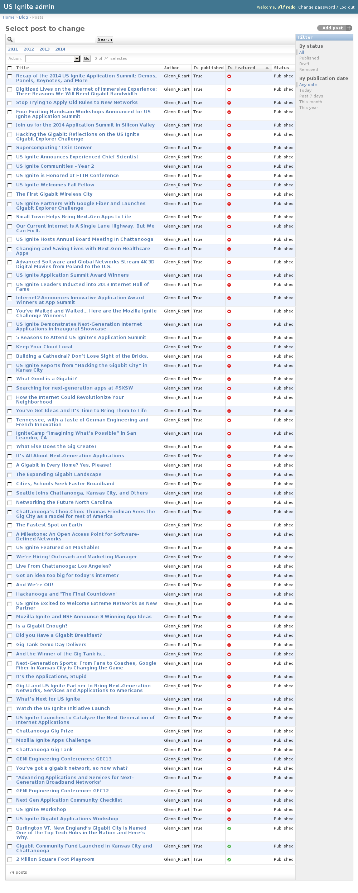
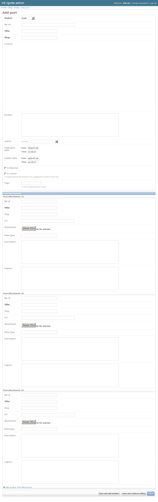
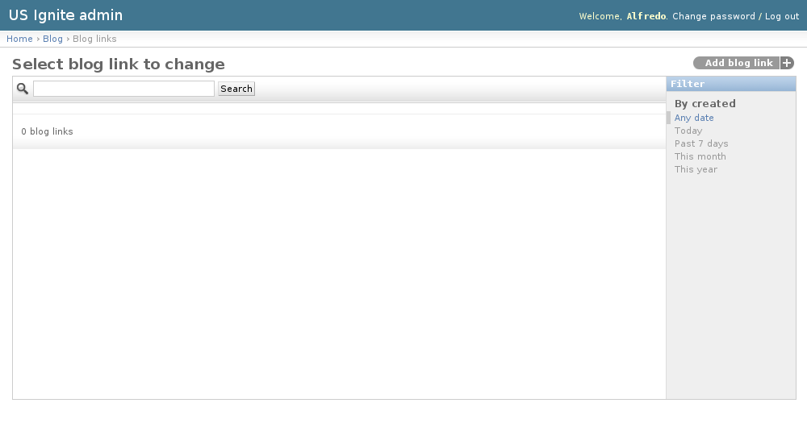
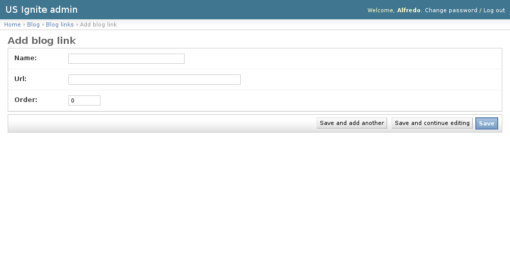

Blog admin section
------------------

This section list the ``blog`` section and its usage in the site. The blog section manages directly the blog posts that appear in the site.

Although these blog posts are imported from the heroku wordpress instance which is used to generate the content providing a familiar interface to US Ignite.

View existing Posts
-------------------

The existing Posts can be listed in the ``/admin/blog/post/`` URL. From this section the details of these Posts can be inspected.

And the following actions can be performed:

- View the details of the Posts.
- Filter the Posts by: status and publication date.
- Search the Posts by their contents.

Adding Posts
------------

Adding posts **must** be  done from the heroku wordpress instance.

Once the a Post has have been published in wordpress they are made available via an HTTP API to the the site. The site checks at regular intervals if there is any new blog posts available.

Once the site finds a new blog posts that needs to be imported it populate the right fields in the site and makes it available.

The default owner of the blog posts is specified in the ``WP_EMAIL`` setting in the codebase.

.. note::
   Once a post has been imported the details won't be imported again, so corrections should be done in Edit post section.

Editing Posts
-------------

This section is used to edit imported Posts. The detail URL of a blog post is available from list blog posts section:``/admin/blog/post/``.

The following fields are available in the Posts:

- Title: Required. Title of the post.
- Slug: Required. Slug used in the URL.
- Content: Optional. HTML content of the blog post. This content is HTML imported and sanitized from the wordpress instance.
- Wp url: Optional. Wordpress of the original imported URL (if available).
- Excerpt: Optional. Short summary used to describe the content.
- Author: Author of the post.
- Publication date: Optional. Date when the blog post was publicated.
- Update date: Optional. Date when the post was last updated
- Is featured: Optional. Show this post should be shown as part of the feature list.
- Status: Required. Determines if the post is public or not.
- Is custom: Optional. If marked will stop the importer from updating the content of this Post.
- Tags: Optional. A comma-separated list of tags.
- Post attachments. Imagery that is part of the Post.

.. note::
   Only the latest the featured items will be shown. Make sure elements that are not required to be featured are marked as non-featured.

Unpublishing / Removing  Posts
------------------------------

In case Posts needs unpublishing it can be done from the detail admin view by changing the ``status`` of the Posts to ``draft`` or ``removed``

.. note::
   The Posts can be browsed in the ``/admin/blog/post/`` URL.

View existing Blog Links
------------------------

The blog links is a list of links that appear in the sidebar of the Blog section.

The existing Blog Links can be listed in the ``/admin/blog/bloglink/`` URL. From this section the details of these Blog Links can be inspected.

And the following actions can be performed:

- View the details of the Blog Links.
- Filter the Blog Links by: creation date.
- Search the Blog Links by their contents.

Adding Blog Links
-----------------

Adding Blog Links can be done from the ``/admin/blog/bloglink/add/`` URL.

The following fields are available to create Blog Links:
- Name: Required. Name to be used in the link.
- URL: Required. Full qualified URL to use in the link.
- Order: Required. Order in which the link will appear.

Removing Blog Links
-------------------

In case a Blog Links needs removing it can be done using the ``delete`` button in the detail page.

.. note::
   The Blog Links can be browsed in the ``/admin/blog/bloglink/`` URL.
