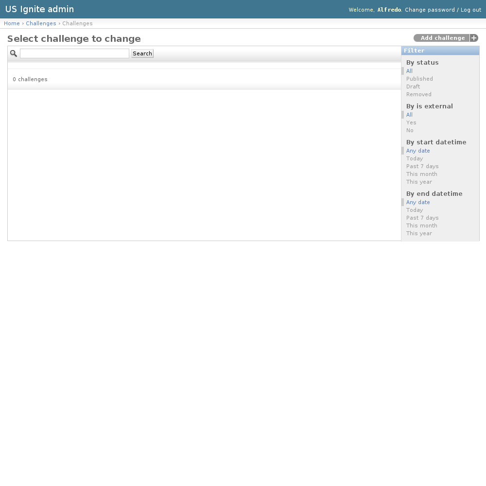
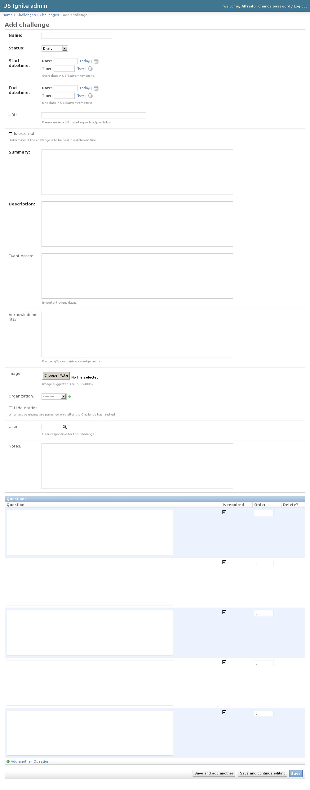
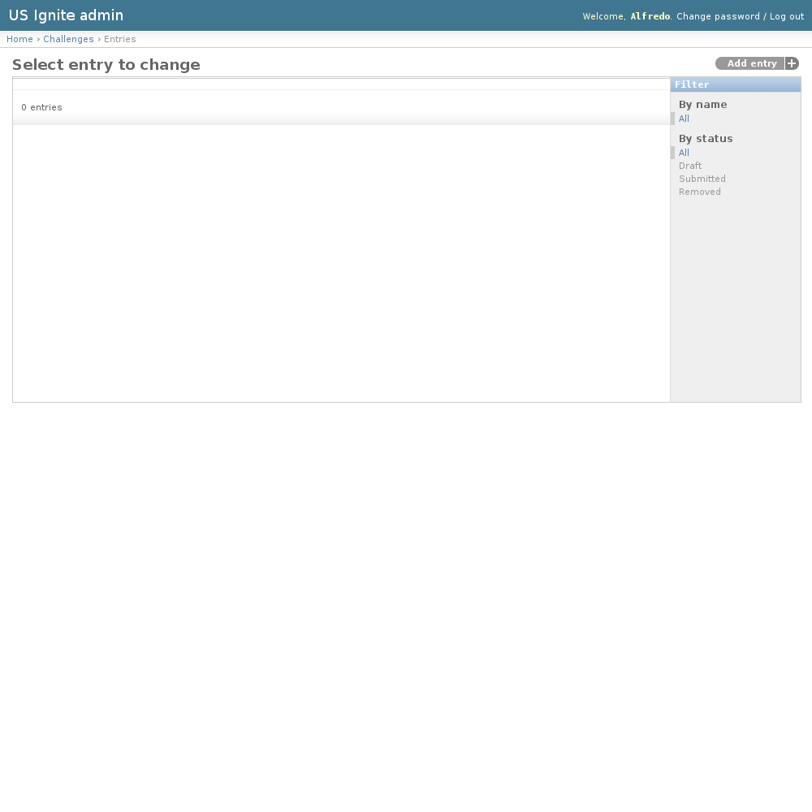
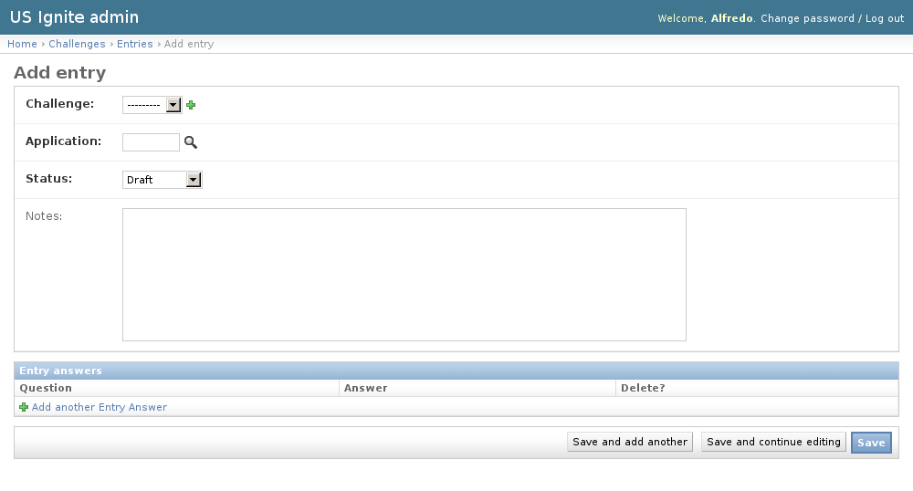

Challenges admin section
========================

This section list the ``challenges`` section and its usage in the site.

View existing Challenges
------------------------

The existing Challenges can be listed in the ``/admin/challenges/challenge/`` URL. From this section the details of these Challenges can be inspected.

And the following actions can be performed:

- View the details of the Challenges.
- Filter the Challenges by: status, is external?, start date/time, end date/time.
- Search the Challenges by their contents.

Adding Challenges
-----------------

The challenges are a list of questions that the application owners can fill in in order to participate.

Adding Challenges can only be added via the the admin URL: ``/admin/challenges/challenge/add/``.

The following fields are available to create Challenges:

- Name: Required. Name of the challenge.
- Status: Required. Status of the publication of the challenge.
- Start datetime: Required. Start date of the challenge in US/Eastern timezone.
- End datetime: Required. End date of the challenge in US/Eastern timezone.
- URL: Optional. Fully qualified URL in case the challenge takes place in a different site. (Please enter a URL starting with http or https).
- Is external: Optional. Determines if the challenge is to be held in a different Site.
- Summary: Required. Short description of the challenge.
- Description: Required. Description of the challenge.
- Event dates: Optional. Important event dates.
- Acknowledgments: Optional. Partners/Sponsors/Acknowledgements
- Image: Optional. Image descriptive for the challenge. Suggested size: 500x400px.
- Organization: Optional. Will be displayed as an organization associated to this event.
- Hide entries: Optional. Determines if the active entries are published only after the Challenge has finished.
- User: Optional. User responsible for this Challenge, will appear in the detail page.
- Notes: Optional. Admin notes regarding this challenges, not displayed in the site.
- Questions. Unlimited. The questions will be displayed in the order specified. The will be shown as a form in the order specified to the participants. The answers to the questions will be required (if specified) in order to participate.

.. note::
   The hide entries flag changes the mechanics of the competition by showing them while the competion is open or not.

Unpublishing / Removing  Challenges
-----------------------------------

In case Challenges needs unpublishing it can be done from the detail admin view by changing the ``status`` of the Challenges to ``draft`` or ``removed``

.. note::
   The Challenges can be browsed in the ``/admin/challenges/challenge/`` URL.

View existing Entries
---------------------

The existing Entries can be listed in the ``/admin/challenges/entry/`` URL. From this section the details of these Entries can be inspected.

And the following actions can be performed:

- View the details of the Entries.
- Filter the Entries by: Challenge or status.

View Entry detail
-----------------

Opening the existing entries will show the details of the application and the questions answered.

The following fields are visible in the detail of the Entries:

- Challenge: Required. Challenge for this entry.
- Application: Required. Application associated to this entry.
- Status: Required. Status of this entry.
- Notes: Optional. Admin notes, not visible on the site.

Adding Entries
--------------

Adding entries must strictly be done via the front end of the Challenge form once it has opened.

Removing  Entries
-----------------

In case Entries needs unpublishing it can be done from the detail admin view by changing the ``status`` of the Entries to ``draft`` or ``removed``

.. note::
   The Entries can be browsed and filtered in the ``/admin/challenges/entry/`` URL.

