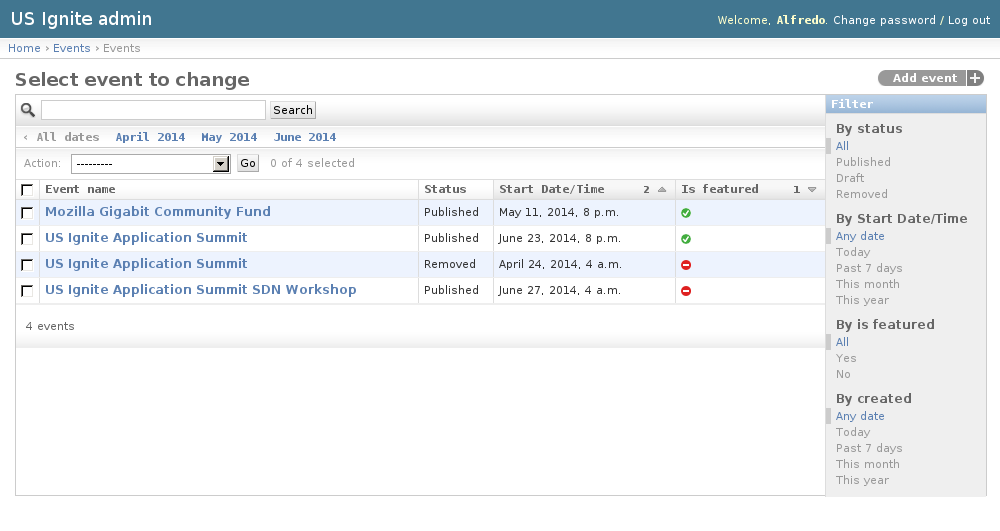
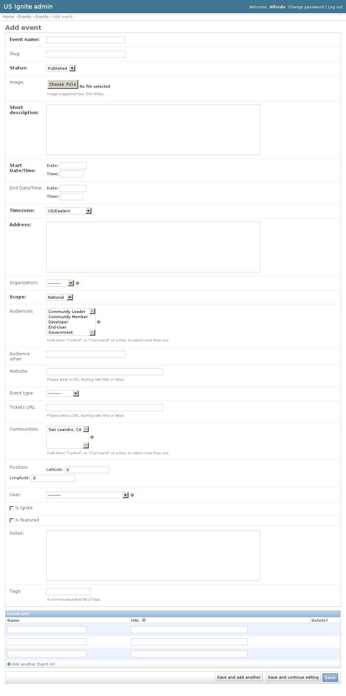
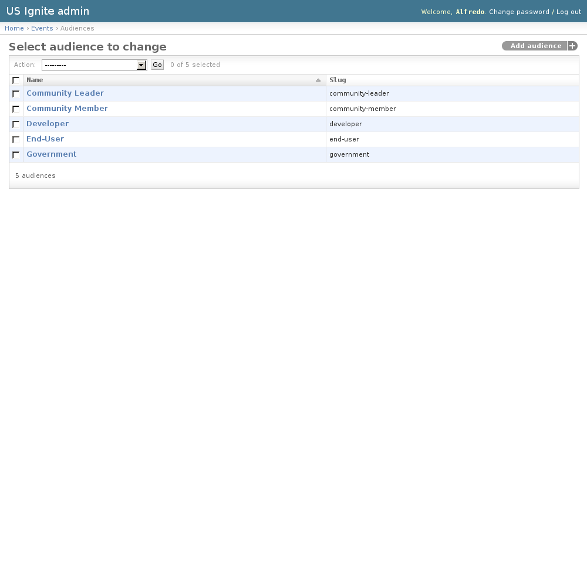
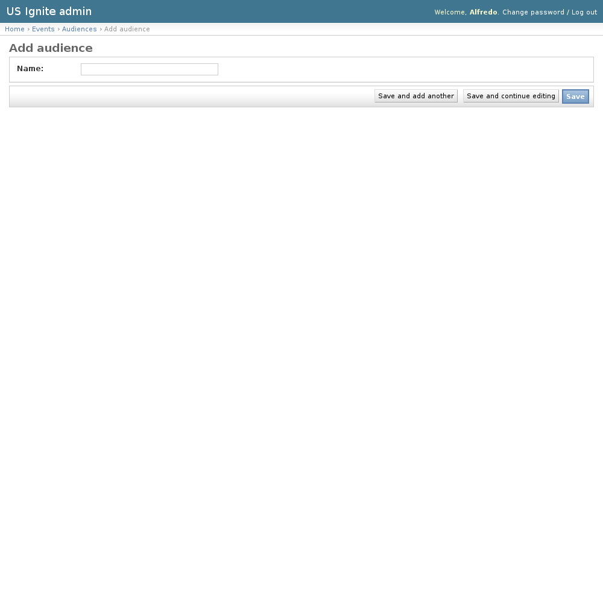

Events admin section
====================

This section list the ``events`` section and its usage in the site.

View existing Events
--------------------

The existing Events can be listed in the ``/admin/events/event/`` URL. From this section the details of these Events can be inspected.

And the following actions can be performed:

- View the details of the Events.
- Filter the Events by: Status, Start date/time, Is featured? or Creation date.
- Search the Events by their contents.

Adding Events
-------------

Adding Events can be done from the front end of the application or the  ``/admin/events/event/add/`` URL.

The following fields are available to create Events:

- Event name: Required. Name of the event.
- Slug: Optional. Slug used for the event.
- Status: Required. Publication status of the event.
- Image: Optional. Image describing the event. Suggested size: 500x400px.
- Short description: Required. Short summary of the event.
- Start Date/Time: Required. Start date/time of the event.
- End Date/Time: Optional. End date/time of the event if applicable.
- Timezone: Required. US Timezone used for the event.
- Address: Required. Address of the event.
- Organization: Optional. Organization associated to this event.
- Scope: Required. Scope of the event: National or Regional.
- Audiences: Optional. Target audience for this event.
- Audience other: Optional. Other audience not listed in the previous option.
- Website: Optional. Fully qualified URL for the event. (URL starting with http or https).
- Event type: Optional. Category of the event.
- Tickets URL: Optional. Fully qualified URL to get tickets for this event.
- Communities: Optional. Communities associated to this event.
- Position: Optional. Location of this event in a map.
- User: Optional. Owner of this event.
- Is ignite?: Optional. Determines if the event is an Ignite event.
- Is featured?: Optional. Determines if the event should be shown as part of the featured list.
- Notes: Optional. Admin notes regarding this event, not public.
- Tags: Optional. A comma-separated list of tags.
- Event URLs: Extra URLs associated to this event.

Unpublishing / Removing  Events
-------------------------------

In case Events needs unpublishing it can be done from the detail admin view by changing the ``status`` of the Events to ``draft`` or ``removed``

.. note::
   The Events can be browsed in the ``/admin/events/event/`` URL.

View existing Audiences
-----------------------

Audiences are a list of audiences receptive for the events, used in the select menu when creating one.

The existing Audiences can be listed in the ``/admin/events/audience/`` URL. From this section the details of these Audiences can be inspected.

And the following actions can be performed:

- View the details of the Audiences.

Adding Audiences
----------------

Adding Audiences can be done from the ``/admin/events/audience/add/`` URL.

The following fields are available to create Audiences:

- Name: Required. Name for the audience.

.. notes::
   An slug will be generated for the feature automatically based on the name.

