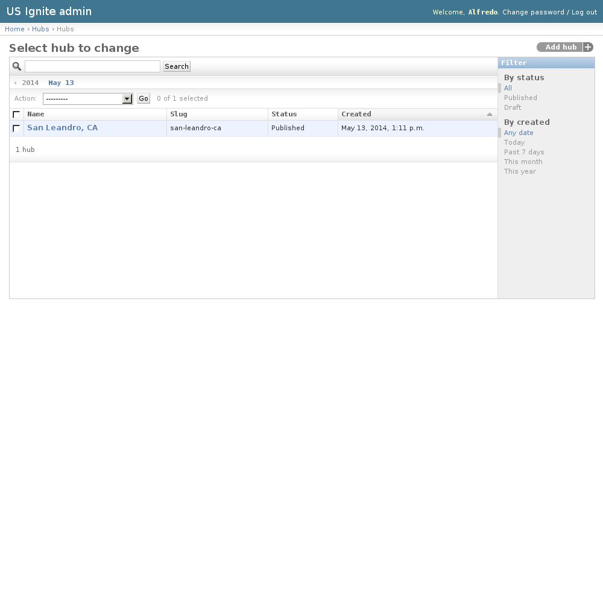

Communities admin section
=========================

This section list the ``hubs`` section and its usage in the site.

View existing Community Requests
--------------------------------

Users can apply to be the managers of an Ignite Community, these requests are listed in this section.

The existing Hub Requests can be listed in the ``/admin/hubs/hubrequest/`` URL. From this section the details of these Hub Requests can be inspected.

And the following actions can be performed:

- View the details of the Hub Requests.
- Filter the Hub Requests by: Status or Creation date.
- Search the Hub Requests by their contents.

Adding Community Requests
-------------------------

Community requests **must** be only added from the front end of the application.

Managing Community Requests
---------------------------

Community requests will be notified via email. and these can be managed in the detail page of the request.

The detail page of the notifications can be accessed in the ``/admin/hubs/hubrequest/`` URL.

On the detail page of the request there is a link on the top right-hand corner that says "Approve this request".

.. image:: ../snapshots/admin--hubs--hubrequest--4.png
   :width: 100%

From here the community request can be approved or rejected.

.. note::
Once approved the communities are ready for the users to complete the Community profile and then publish it. If the community is not published it won't be available anywhere in the site.

.. image:: ../snapshots/admin--hubs--hubrequest--approve--4.png
   :width: 100%

View existing Communities
-------------------------

The existing Communities can be listed in the ``/admin/hubs/hub/`` URL. From this section the details of these Hubs can be inspected.

And the following actions can be performed:

- View the details of the Communities.
- Filter the Communities by: status or creation date.
- Search the Communities by their contents.

Adding Communities
------------------

Adding new Communities can be done as well from the admin section available in the ``/admin/hubs/hub/add/`` URL.

The following fields are available to create Communities:

- Name: Required. Name of the community.
- Summary: Optional. Short description of the community.
- Description: Required. Description of the community.
- Contact: Optional. User that will be listed as the main contact for this community.
- Image: Optional. Image that depicts this community. Suggested size: 500x400px.
- Website: Optional. Website of this community, must be a fully qualified URL.
- Features: Optional. Existing NextGen features in this community.
- Position: Optional. Position of the community in a map.
- Notes: Optional. Admin notes of this community not visible in the site.
- Status: Required. Publication status of this community.
- Show in the homepage?: Optional. If marked this element will be shown in the homepage.
- Is featured: Optional. Determines if the community will appear in the featured list.
- Tags: Optional. A comma-separated list of tags.

.. image:: ../snapshots/admin--hubs--hub--add.png
   :width: 100%

Unpublishing / Removing Communities
-----------------------------------

In case Communities needs unpublishing it can be done from the detail admin view by changing the ``status`` of the Community to ``draft`` or ``removed``

.. note::
   The Hubs can be browsed in the ``/admin/hubs/hub/`` URL.
