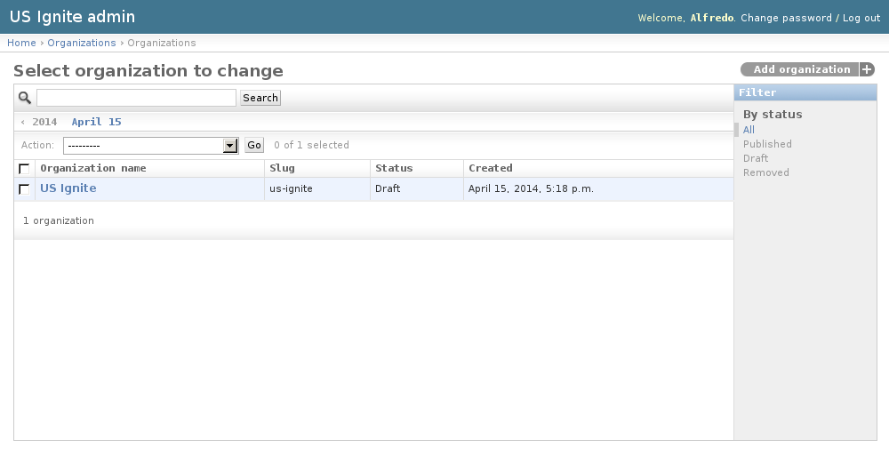
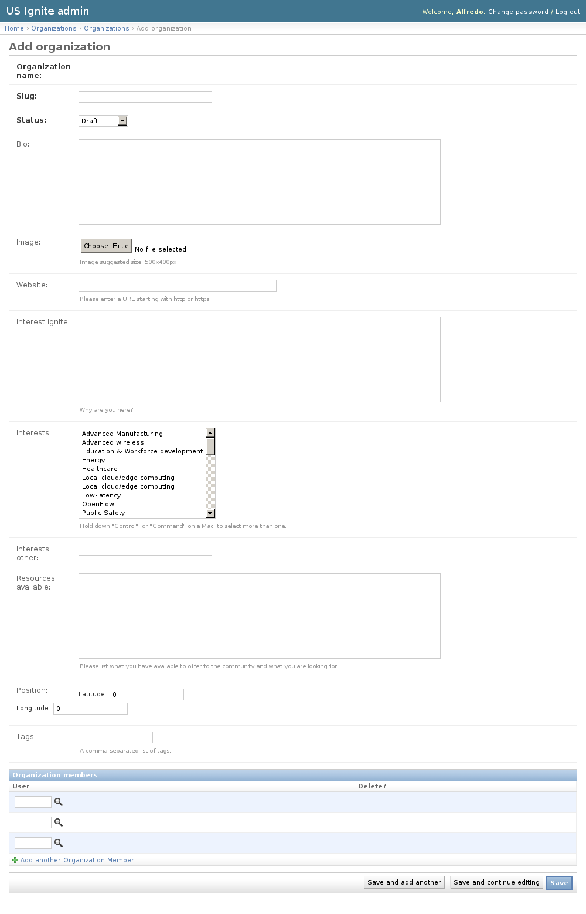

Organizations admin section
===========================

This section list the ``organizations`` section and its usage in the site.

Organizations can only be added by US Ignite via the admin section.

View existing Organizations
---------------------------

The existing Organizations can be listed in the ``/admin/organizations/organization/`` URL. From this section the details of these Organizations can be inspected.

And the following actions can be performed:

- View the details of the Organizations.
- Filter the Organizations by: status.
- Search the Organizations by their contents.

Adding Organizations
--------------------

Organizations can only be added by US Ignite via the admin section. Once a user is associated to the organization as a member the user can edit the details of the Organization from the front end of the application.

.. note::
   Any user member can add more members part of the organization that will be able to edit its profile in the front end of the application. Members can also remove other members.

Adding Organizations can be done from the ``/admin/organizations/organization/add/`` URL.

The following fields are available to create Organizations, these fields will appear in the Organization profile page:

- Organization name: Required. Name of the organization.
- Slug: Required. Slug used in the site for this organization.
- Status: Required. Publication status of this organization.
- Bio: Optional. Description of the organization.
- Image: Optional. Image descriptive of the organization. Suggested size: 500x400px.
- Website: Optional. Fully qualified URL for this organization.
- Interest ignite: Optional. Description of the interest in Ignite.
- Interests: Optional. Interests of the organization.
- Interests other: Optional. Other interests in case they are not listed in the option above.
- Resources available: Optional. Resources available to offer to the community from the organization.
- Position: Optional. Localization of the organization in a map.
- Tags: Optional. A comma-separated list of tags.

Unpublishing / Removing  Organizations
--------------------------------------

In case Organizations needs unpublishing it can be done from the detail admin view by changing the ``status`` of the Organizations to ``draft`` or ``removed``

.. note::
   The Organizations can be browsed in the ``/admin/organizations/organization/`` URL.

Removing Members of Organizations
---------------------------------

Removing members of the organizations can be done from the detail view by selecting the existing member to be removed and clicking the ``save`` button.

.. note::
   The Organizations can be browsed in the ``/admin/organizations/organization/`` URL.
