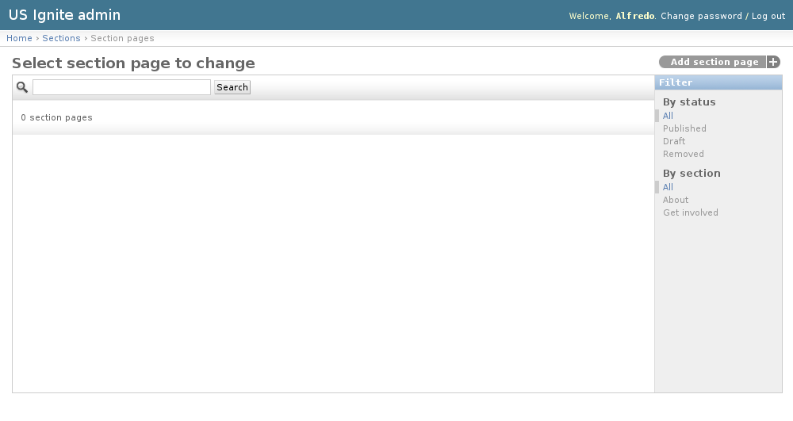
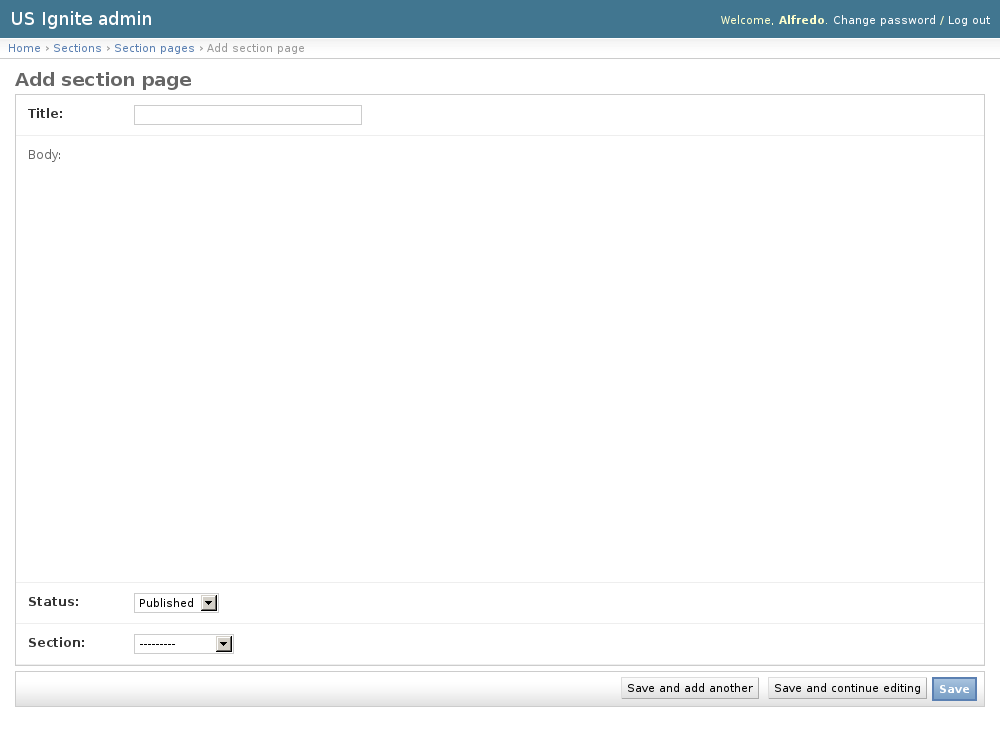
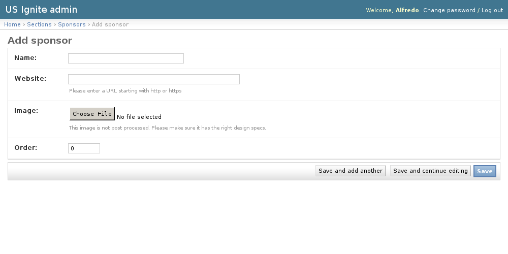

Sections admin section
======================

This section list the ``sections`` section and its usage in the site.

View existing Section Pages
---------------------------

The section pages are dynamic pages that appear in the "about" or "get involved" sections.

The existing Section Pages can be listed in the ``/admin/sections/sectionpage/`` URL. From this section the details of these Section Pages can be inspected.

And the following actions can be performed:

- View the details of the Section Pages.
- Filter the Section Pages by: status or section.
- Search the Section Pages by their contents.

Adding Section Pages
--------------------

The section pages are dynamic pages that appear in the "about" or "get involved" sections.

Adding Section Pages can be done from the ``/admin/sections/sectionpage/add/`` URL.

The following fields are available to create Section Pages:

- Title: Required. Name of the page.
- Body: Optional. HTML content of the page.
- Status: Required. Publication status of the page.
- Section: Required. Section where this page will appear.

.. note::
   An what you see is what you get editor has been added to add content to the pages.

Unpublishing / Removing  Section Pages
--------------------------------------

In case Section Pages needs unpublishing it can be done from the detail admin view by changing the ``status`` of the Section Pages to ``draft`` or ``removed``

.. note::
   The Section Pages can be browsed in the ``/admin/sections/sectionpage/`` URL.

View existing Sponsors
----------------------

Sponsors are the organizations listed in the footer.

The existing Sponsors can be listed in the ``/admin/sections/sponsor/`` URL. From this section the details of these Sponsors can be inspected.

And the following actions can be performed:

- View the details of the Sponsors.

.. image:: ../snapshots/admin--sections--sponsor.png
   :width: 100%

Adding Sponsors
---------------

Sponsors are the organizations listed in the footer.

Adding Sponsors can be done from the ``/admin/sections/sponsor/add/`` URL.

The following fields are available to create Sponsors:

- Name: Required. Name of the organization.
- Website: Required. URL of the organization.
- Image: Required. Image to be used in the footer to represent the organization.
- Order: Required. Order for the organization to appear.

Removing  Sponsors
------------------

In case Sponsors needs to be removed clicking on the ``delete`` button of the detail page will inmediately remove it from the footer.

.. note::
   The Sponsors can be browsed in the ``/admin/sections/sponsor/`` URL.
