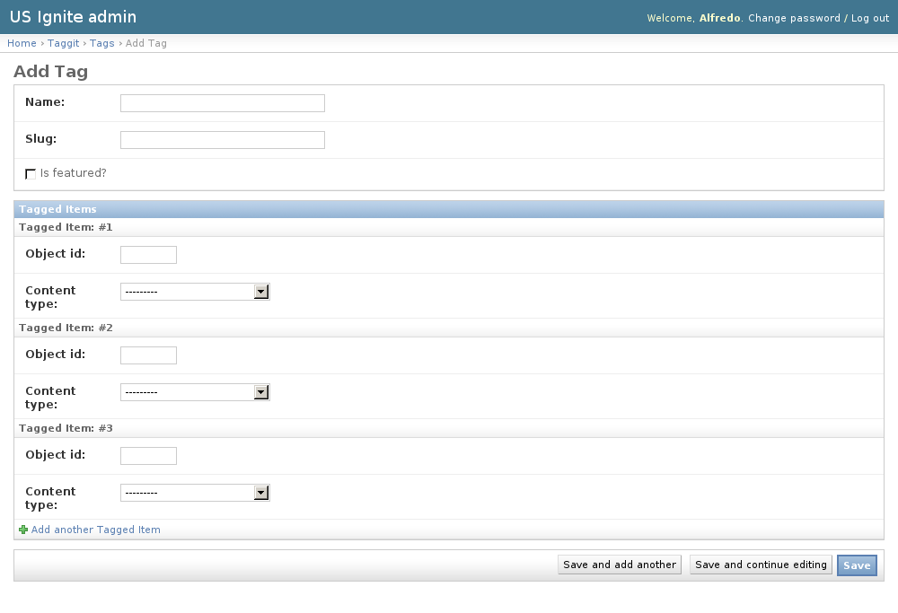

Taggit admin section
====================

This section list the ``taggit`` section and its usage in the site.

The tags are used across different elements of the site and are used to classify the elements and facilitate their search.

View existing Tags
------------------

The existing Tags can be listed in the ``/admin/taggit/tag/`` URL. From this section the details of these Tags can be inspected.

And the following actions can be performed:

- View the details of the Tags.
- Search the Tags by their contents.

Detail of Tags
--------------

The tags are created by the users of the site. Usually they shouldn need to be created unless extra tags needed to be added to the tag-autocomplete functionality.

The following fields are available to create Tags:

- Name: Required. Name of the tag.
- Slug: Required. Slug used for this tag.
- Is featured?: Optional. Determines if this tag is part of the autocompletion tags.

Removing  Tags
--------------

In case Tags need to be removed they can be removed from the detail page of the tags and clicking in the ``delete`` button.

.. note::
   The Tags can be browsed in the ``/admin/taggit/tag/`` URL.
