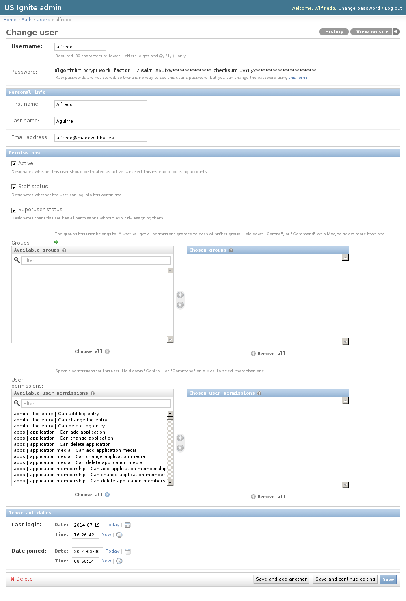

Admin Users
===========

This section manages the users registered in the site.

Grant admin access
------------------

Admin access can only be granted by another administrator.

In order to grant admin access to the user the user should be registered in the site. After this, the access can be granted via the edit user view ``/admin/auth/user/``.

The ``Staff status`` and ``Superuser status`` flags should be marked.

The user is updated by clicking on the ``Save`` button.

Information is available from the registered user such as full name, email address, registration date and last login.
